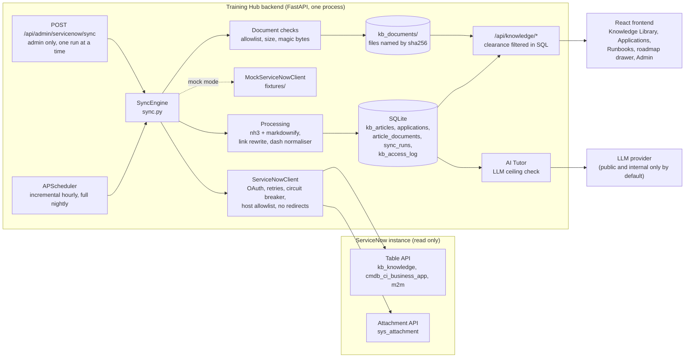

# ServiceNow knowledge integration

The Training Hub pulls runbooks and standard operating procedures from ServiceNow knowledge articles (`kb_knowledge`), so learners always see the current, approved versions. For each article it keeps the classification, the application numbers and names, and the relevant documents (attachments and linked articles).

The integration is **read only**: the Training Hub never writes to ServiceNow. It runs in **mock mode** (synthetic fixtures, no network) by default in development, in CI and in the end to end tests.

## Contents

1. [Architecture](#architecture)
2. [Quick start in mock mode](#quick-start-in-mock-mode)
3. [Connecting a ServiceNow developer instance](#connecting-a-servicenow-developer-instance)
4. [The integration account](#the-integration-account)
5. [Environment variables](#environment-variables)
6. [Editing mapping.yaml](#editing-mappingyaml)
7. [Sync behaviour](#sync-behaviour)
8. [Content processing](#content-processing)
9. [Classification and access control](#classification-and-access-control)
10. [API](#api)
11. [Troubleshooting](#troubleshooting)
12. [Known limitations](#known-limitations)

## Architecture



Code lives in `backend/app/integrations/servicenow/`:

| File | Role |
|---|---|
| `settings.py` | Environment variables, secrets as `SecretStr` |
| `mapping.yaml`, `mapping.py` | Field mapping, validated with Pydantic at startup |
| `urls.py` | SSRF guard: HTTPS, allowlisted host, no credentials, ports, paths or IP literals |
| `client.py` | Table and Attachment API client, OAuth, retries, circuit breaker |
| `mock.py`, `fixtures/` | Mock client and synthetic data in the Table API's own shape |
| `redaction.py` | Log filter that masks credentials and tokens |
| `processing.py` | HTML to safe markdown, link and image rewriting |
| `documents.py` | Attachment allowlist, size limit, magic byte checks, storage |
| `sync.py` | Incremental and full sync, one run at a time |
| `scheduler.py` | APScheduler jobs in the API process |

Read access for learners is in `services/knowledge_service.py` and `routers/knowledge.py`; administration in `routers/servicenow_admin.py`; the rules in `services/classification.py`.

**Why the scheduler runs in the API process:** the app is deployed as one uvicorn process on SQLite. A separate worker would need its own container, a shared volume and cross process locking, for no gain at this scale. The `sync_runs` "running" guard keeps runs from overlapping even if more workers are added later.

## Quick start in mock mode

With `APP_ENV=development` nothing needs configuring: the integration is enabled in mock mode, and the first incremental sync runs 15 seconds after startup.

```bash
cd backend
.venv/Scripts/python ../scripts/servicenow_probe.py     # checks the mapping against the fixtures
.venv/Scripts/uvicorn app.main:app --reload --port 8000
```

Sign in as the admin, open **Admin**, and use **Sync now** or **Full sync** to sync on demand. The fixtures contain 15 fictional articles across 4 fictional applications (APM0001001 to APM0001004), all four classification levels plus one unmapped value, one retired article, one expired article, one article in a knowledge base outside the filter, hostile HTML, and a PDF, DOCX, PNG, TXT and an executable disguised as a PDF (rejected by the sync).

Set `SERVICENOW_ENABLED=false` to switch the integration off entirely.

## Connecting a ServiceNow developer instance

1. **Get an instance.** Sign up at the ServiceNow Developer Program and request a Personal Developer Instance. You get an address like `https://devNNNNN.service-now.com` and an admin login. Developer instances hibernate when idle and are reclaimed after a period of inactivity, so use them for testing only.
2. **Prepare test content.** Create one or two knowledge bases with a few published articles, give them categories named `Runbook` and `SOP`, attach a PDF, and set the configuration item (`cmdb_ci`) of each article to a business application. Never copy real company content into a developer instance.
3. **Classification field.** ServiceNow has no standard classification field on knowledge articles. Either add a choice field (for example `u_classification` with Public, Internal, Confidential, Restricted), or decide to classify by knowledge base or category (see [classification](#classification-and-access-control)).
4. **Create the integration account** as described in [the next section](#the-integration-account).
5. **Register an OAuth client.** In *System OAuth > Application Registry*, create an OAuth API endpoint for external clients and note the client id and secret.
   - With the **client credentials** grant, the token acts as the user configured on the OAuth application (set it to the integration account). Newer releases need the client credentials grant enabled in the instance's OAuth settings; check your release's documentation.
   - Otherwise the client uses the **password** grant: set `SERVICENOW_USERNAME` and `SERVICENOW_PASSWORD` for the integration account as well as the client id and secret.
6. **Configure the Training Hub** in `backend/.env` (never commit it):

   ```ini
   SERVICENOW_ENABLED=true
   SERVICENOW_MOCK_MODE=false
   SERVICENOW_INSTANCE_URL=https://devNNNNN.service-now.com
   SERVICENOW_AUTH_MODE=oauth
   SERVICENOW_CLIENT_ID=...
   SERVICENOW_CLIENT_SECRET=...
   ```

   Basic auth (`SERVICENOW_AUTH_MODE=basic`) is accepted only when `APP_ENV=development`, for developer instances.
7. **Edit `mapping.yaml`**: replace the placeholder knowledge base sys_ids in `encoded_query`, and adjust field names (see [below](#editing-mappingyaml)).
8. **Run the probe** and fix anything it reports as `MISSING` or `empty`:

   ```bash
   backend/.venv/Scripts/python scripts/servicenow_probe.py --limit 3
   ```

   It prints field states, body lengths and hashes only: no credentials, titles or article text, so its output is safe to share.
9. **Start the backend** and run **Full sync** from the Admin panel. Check the run in *Recent sync runs*.

## The integration account

Use a **dedicated, read only service account** that exists only for this integration:

- A local ServiceNow user, not a person's account, with **Web service access only** enabled so it cannot sign in to the UI.
- **No `admin`, `itil` or any write capable role.** The Training Hub only ever sends `GET` requests (plus the OAuth token request).
- Read access to exactly what is synced:
  - `kb_knowledge` articles in the selected knowledge bases. Knowledge access is granted through *user criteria* on each knowledge base ("Can read"); add the integration account only to the knowledge bases you sync.
  - The CI table used for applications (by default `cmdb_ci_business_app`), for example through the `cmdb_read` role or a narrower read ACL.
  - The many to many table if `applications.mode` is `m2m`.
  - `sys_attachment` records of those articles. Attachment read access normally follows read access to the parent record.
- If the instance restricts REST access (REST API access policies, or a role such as `snc_platform_rest_api_access`), grant only what the Table and Attachment APIs need.
- Rotate the OAuth secret on a schedule, and store it only in the deployment's secret store.

The account can read more than an individual learner should see. That is why the Training Hub enforces classification itself, for every learner, on every endpoint (see [below](#classification-and-access-control)).

## Environment variables

All are read from the environment (or `backend/.env`); see `backend/.env.example`.

| Variable | Default | Purpose |
|---|---|---|
| `SERVICENOW_ENABLED` | `true` in development, `false` otherwise | Turns the integration on |
| `SERVICENOW_MOCK_MODE` | `true` in development, `false` otherwise | Synthetic fixtures, no network |
| `SERVICENOW_INSTANCE_URL` | | `https://<instance>.service-now.com`; must match the allowlist |
| `SERVICENOW_ALLOWED_HOSTS` | `*.service-now.com` | Comma separated host patterns the instance URL must match |
| `SERVICENOW_AUTH_MODE` | `oauth` | `oauth`, or `basic` (development only) |
| `SERVICENOW_CLIENT_ID`, `SERVICENOW_CLIENT_SECRET` | | OAuth client |
| `SERVICENOW_USERNAME`, `SERVICENOW_PASSWORD` | | Integration account (password grant or basic auth) |
| `SERVICENOW_SYNC_INTERVAL_MINUTES` | `60` | Incremental sync interval (5 to 1440) |
| `SERVICENOW_FULL_SYNC_HOUR` | `2` | Hour (UTC) of the nightly full reconciliation |
| `SERVICENOW_SCHEDULER` | `true` | `false` disables the schedule; manual syncs still work |
| `SERVICENOW_MAX_DOC_MB` | `25` | Largest attachment downloaded |
| `SERVICENOW_STALE_HOURS` | `24` | Learners see a stale banner after this long without a successful sync |
| `SERVICENOW_LLM_MAX_CLASSIFICATION` | `internal` | Highest classification ever sent to the LLM provider |
| `SERVICENOW_MAPPING_PATH` | `app/integrations/servicenow/mapping.yaml` | Use a mapping file kept outside the repository |
| `KB_DOCUMENTS_DIR` | `kb_documents` next to the database | Where synced documents are stored |

## Editing mapping.yaml

Every field name and value comes from `backend/app/integrations/servicenow/mapping.yaml`. It is validated at startup; an unknown key, a missing required field or an unsafe field name stops the app with a clear message. After editing, run the probe and restart the backend.

The shipped mapping follows the standard `kb_knowledge` schema. Lines marked `(A)` are assumptions beyond the standard schema.

| Section | What it controls |
|---|---|
| `source_table`, `encoded_query` | Table and filter. Keep `workflow_state=published^latest=true` and list your knowledge base sys_ids. The sync adds the watermark condition and ordering itself, so the query must not contain `ORDERBY`. |
| `published_states` | `workflow_state` values that count as live; anything else is retired on the next full sync. |
| `fields` | One entry per concept: `name` is the ServiceNow field, `read` is `value` (raw value, for example a sys_id), `display` (display value, for example a name) or `both`. The Table API applies `sysparm_display_value` to the whole request, so the client asks for `all` when any field needs a display value and reads each field from the right part. |
| `classification` | `source: field` (a field on the article), `category` or `knowledge_base` (the display name), and `values`, mapping source values (case and spacing ignored) to `public`, `internal`, `confidential` or `restricted`. Anything unmapped or empty becomes `restricted`. |
| `applications` | `mode: cmdb_ci` (the article's configuration item, looked up in `ci_table`), `article_fields` (number and name fields on the article) or `m2m` (an article to CI table). Only the selected block is used. |
| `types` | Which category (or article type) values make an article a `runbook` or `sop`. Those appear in the Runbook Library; the rest are `other`. |
| `documents` | Whether to sync attachments and linked articles, and the allowed types (a subset of PDF, DOCX, XLSX, PPTX, TXT, PNG, JPG). |
| `node_links` | Links to roadmap topics by application number (`by_application`) or by a word in the title or category (`by_keyword`). Admins can add manual links too. |

## Sync behaviour

- **Incremental** (on the interval, and **Sync now**): fetches articles with `sys_updated_on >=` the last successful watermark, oldest first. Articles whose content hash is unchanged are skipped. The condition is `>=` so an article updated in the same second as the watermark is not lost.
- **Full** (nightly, and **Full sync**): fetches the whole filter. Active articles that are no longer returned, are no longer published, or are past `valid_to` are marked inactive. Nothing is ever deleted; inactive articles disappear from every learner view and from the AI Tutor.
- **Identity:** articles are keyed by KB number. A new version in ServiceNow is a new record with a new sys_id and the same number, and it updates the same Training Hub article.
- **Applications** are upserted by number and linked to their articles on every change.
- **Documents:** only allowed types are downloaded; the declared content type must match the extension; the size limit is checked before and during the download; the real type is checked by magic bytes (Office files by their zip directory). Files are stored by sha256 name outside any public folder and served only through the access checked download endpoint. Attachments in ServiceNow are immutable, so a known attachment is never downloaded twice.
- **Runbooks and SOPs** appear in the Runbook Library as read only entries (ids `100000 + article id`, so the dataset's local runbooks can never collide with them) that open the article page.
- **One run at a time:** a process lock plus a `running` row in `sync_runs`; a second request gets HTTP 409. Runs left `running` by a stopped process are closed at startup.
- **Failures:** one bad article is logged and skipped and the run is marked `partial`; the watermark stays at that article so it is fetched again. A connection failure marks the run `failed`, changes nothing, and learners see a banner saying the content may be stale while cached content keeps working.
- **Resilience:** connect timeout 5 s, read timeout 30 s, up to 4 attempts with exponential backoff and jitter on 429, 5xx and connection errors, honouring `Retry-After` (capped at 60 s). After 5 consecutive failed calls a circuit breaker refuses calls for 5 minutes.

Every run is recorded in `sync_runs` and shown in the Admin panel with counts and error details (credentials are redacted before anything is stored or logged).

## Content processing

- The article HTML is cleaned with **nh3**: scripts, styles, iframes, objects, inline event handlers, inline styles and any URL scheme other than http, https and mailto are removed. It is then converted to markdown with **markdownify**, and a last pass drops any markdown link whose target is not http(s), mailto or a site relative path.
- **Images:** attachments of the article are kept and served by the Training Hub; remote images are dropped.
- **Links:** links to other KB articles become `/knowledge/kb/KB...` (resolved by number in the app) when that article is synced, otherwise links to the article on the instance. Other links are kept and open in a new tab with `rel="noopener noreferrer"`.
- **Dash rule:** the displayed title, summary and body go through `services/prose.py` `normalise_dashes`, which uses the same patterns as `scripts/check_no_dashes.py`. Ranges become "to", short labels take a colon, other separator dashes become commas; code blocks, inline code, SQL and URLs are kept byte for byte.
- The raw HTML is stored in `kb_articles.body_raw_html` as the source of truth. It is never returned by the API or rendered.
- The frontend renders the markdown with `react-markdown` and `rehype-sanitize`, without raw HTML.

## Classification and access control

| Level | Who sees it by default | AI Tutor (default ceiling) |
|---|---|---|
| Public | everyone | yes |
| Internal | everyone (default clearance) | yes |
| Confidential | users with confidential or restricted clearance | never |
| Restricted | users with restricted clearance | never |

- Each user has a **maximum clearance** (`users.max_classification`, default `internal`). Admins change it in the users table of the Admin view; it applies on the person's next request. Admins start with `restricted`, since they can change any clearance, their own included.
- Filtering happens **in the SQL query** of every endpoint that returns articles, documents, applications, search results, runbooks or AI Tutor context. The frontend only labels.
- **Fail closed:** an unknown or missing classification is `restricted`; an unknown clearance is `public`.
- **Hidden looks missing:** an article, document or application the user may not see returns the same 404 as one that does not exist.
- **AI Tutor:** articles above `SERVICENOW_LLM_MAX_CLASSIFICATION` are refused (HTTP 403) before anything is sent to the LLM provider, whoever asks. Allowed articles are sent inside a delimited `<reference_article>` block with every delimiter tag escaped, and the system prompt tells the model to treat it as reference data, never as instructions (articles can contain prompt injection).
- **Audit:** every view and download of confidential and restricted content is recorded in `kb_access_log` and shown to admins (titles above the admin's own clearance are withheld).
- Local content (the 25 dataset runbooks) is classified `internal`.

## API

All endpoints require a session; the admin ones require the admin role. Interactive docs are at `/docs` in development.

| Endpoint | Purpose |
|---|---|
| `GET /api/knowledge/articles` | Search and filter (`q`, `classification`, `app_number`, `application_id`, `article_type`, `category`, `node_id`, `sort`, `order`, `page`, `page_size` up to 50), with facets |
| `GET /api/knowledge/articles/{id}` | Article with applications, documents, linked articles, related topics, `source_url`, `llm_allowed` |
| `GET /api/knowledge/articles/by-number/{kb}` | Resolves in article links |
| `GET /api/knowledge/applications`, `/applications/{id}` | Applications with counts; detail grouped into runbooks, SOPs, other and documents |
| `GET /api/knowledge/documents/{id}/download` | Streams the stored file: `Content-Disposition: attachment`, verified type, `nosniff`, never a redirect |
| `GET /api/knowledge/status` | Stale and unreachable flags for the learner banner |
| `GET /api/admin/servicenow/status` | Mode, connection, counts, last and next sync (no secrets) |
| `POST /api/admin/servicenow/sync?mode=incremental\|full` | Starts a background sync (202 with run id, 409 while one runs) |
| `GET /api/admin/servicenow/runs`, `/runs/{id}` | Run history |
| `GET /api/admin/servicenow/mapping` | The active mapping, read only |
| `GET /api/admin/servicenow/audit` | Access audit |
| `POST`, `DELETE /api/admin/servicenow/articles/{id}/nodes/{node_id}` | Manual links to roadmap topics |
| `PUT /api/admin/users/{id}/clearance` | Set a user's maximum clearance |

## Troubleshooting

| Symptom | Likely cause and fix |
|---|---|
| App refuses to start: "Invalid ServiceNow mapping" | A key or value in `mapping.yaml` is wrong; the message names it. |
| "SERVICENOW_INSTANCE_URL is not in SERVICENOW_ALLOWED_HOSTS" | Use the bare `https://<instance>.service-now.com` address, or extend the allowlist for a custom domain. |
| Probe: "No articles matched encoded_query" | Wrong knowledge base sys_ids, articles not published, or the account cannot read them (user criteria). |
| Probe: a field is `MISSING` | The field name differs on your instance; fix it in `fields`. ServiceNow silently drops unknown fields. |
| Probe: `text` is `empty` | The instance uses article templates that keep the body in other fields; map `body_html` to the template field. |
| Sync fails with "HTTP 401" or "OAuth token request failed" | Wrong client id or secret, or the grant type is not enabled for the OAuth application. |
| Sync fails with "HTTP 403" | The integration account lacks read access to the table or knowledge base. |
| "ServiceNow answered with a redirect; refusing to follow it" | The instance URL is wrong (for example an SSO landing page) or the instance is hibernating. Wake developer instances first. |
| Runs fail with "ServiceNow is unavailable; retrying later" | The circuit breaker is open after repeated failures; it retries after 5 minutes. |
| An article is missing for a learner | It is above their clearance, retired, past `valid_to`, or outside the filter. Admins see the classification in the Admin panel counts. |
| Every article is Restricted | The classification field or values do not match; check `classification` in the mapping (unmapped values fail closed). |
| A document is missing | It was rejected: see the run's details (type not allowed, declared type mismatch, too large, or content that does not match its type). |
| Learners see "may be out of date" | No successful sync within `SERVICENOW_STALE_HOURS`; check the latest runs. |

## Known limitations

- Attachments added to an article without the article itself changing are picked up by the nightly full sync, not by the incremental one.
- Embedded images are kept only when they are attachments of the same article.
- The mapping has not yet been confirmed against a real instance: run the probe on your instance before the first real sync.
